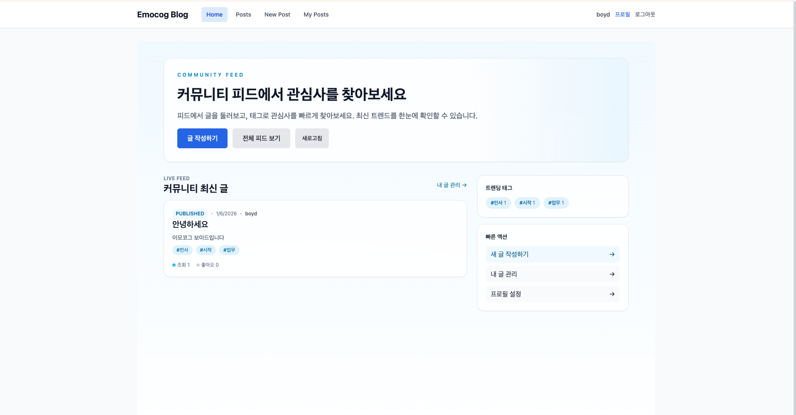

# Emocog Blog

설계 지침에 따라 OpenAI Codex로 구현한 커뮤니티형 블로그 서비스입니다. 로컬 로그인, 글 작성/관리, 프로필 편집, 태그 탐색까지 기본 제공하며 FastAPI(백엔드) + React/TypeScript(프론트) 기반으로 쉽게 확장할 수 있습니다.



## 🚀 Quick Start

```bash
# Clone and setup
git clone <your-repo>
cd <your-project>
make setup

# Start integrated development (recommended)
make dev-integrated
```

통합 개발 서버: http://localhost:8000 (프론트 + API docs)

## 📋 Prerequisites

- Docker and Docker Compose
- Node.js 18+ and pnpm
- Python 3.11+ and Poetry
- Make (for convenience commands)

## 🏗️ Architecture

- **Backend**: FastAPI + SQLAlchemy (async) + PostgreSQL, JWT 로컬 로그인, Posts/Users 모델
- **Frontend**: React + TypeScript + Vite, 커뮤니티형 피드 UI, 태그/검색 기반 글 탐색
- **Database**: PostgreSQL (개발 모드에서 테이블 자동 생성)
- **Testing**: pytest (백엔드), Vitest (프론트)
- **Dev**: Docker Compose, Make 기반 스크립트

## 📁 Project Structure

```
├── backend/                 # FastAPI backend
│   ├── app/                # Application code
│   │   ├── api/           # API endpoints
│   │   ├── core/          # Core configuration
│   │   ├── models/        # Database models
│   │   ├── schemas/       # Pydantic schemas
│   │   ├── services/      # Business logic
│   │   └── repositories/  # Data access layer
│   ├── tests/             # Backend tests
│   └── pyproject.toml     # Python dependencies
├── frontend/              # React frontend
│   ├── src/              # Source code
│   │   ├── components/   # React components
│   │   ├── pages/        # Page components
│   │   ├── hooks/        # Custom hooks
│   │   ├── services/     # API services
│   │   └── types/        # TypeScript types
│   ├── package.json      # Node dependencies
│   └── vite.config.ts    # Vite configuration
├── docs/                 # Documentation
├── docker-compose.yml    # Local development setup
├── Dockerfile           # Production build
└── Makefile            # Development commands
```

## 🛠️ Development Commands

### Quick Start (Recommended)
```bash
# Setup project
make setup

# Integrated development (single server)
make dev-integrated    # Frontend built into backend
# Access at: http://localhost:8000
```

### Core Commands

| Command | Description | Access |
|---------|-------------|---------|
| `make dev-integrated` | **🌟 Recommended**: Single server with built frontend | http://localhost:8000 |

### Development Tools

| Command | Description |
|---------|-------------|
| `make setup` | Install dependencies and setup database |
| `make test` | Run all tests |
| `make lint` | Run linters |
| `make format` | Format code |
| `make build` | Build for production |
| `make clean` | Clean build artifacts |
| `make reset` | Complete project reset |

### Development Workflow

**Integrated Development (Recommended):**
1. `make dev-integrated` - Starts integrated server with auto-built frontend
2. Make backend changes - auto-reloads
3. Make frontend changes - restart `make dev-integrated` to rebuild
4. For production build - use `make build`

**Why Integrated Development?**
- Single server to manage
- Production-like environment
- Simplified deployment workflow
- Frontend automatically rebuilt on server start

## 🔧 Configuration

1. Copy `.env.example` to `.env`
2. Update database and other settings
3. For external integrations (Figma/ClickUp/Google Drive), see MCP integration guide

## 📚 Sample Implementation

- **Auth**: 로컬 이메일/비밀번호 가입 및 로그인 (`/api/auth/register`, `/api/auth/login`)
- **Posts**: 게시글 생성/조회/수정/삭제, 상태(발행/임시/비공개), 태그/카테고리, 조회수/좋아요 필드
- **Profile**: 프로필 조회/수정 (닉네임/소개/아바타 URL)
- **Frontend 피드**: 홈에서 최신 발행 글, 트렌딩 태그, 빠른 액션(글 작성/내 글 관리/프로필) 제공
- **Items CRUD**: 기존 샘플 CRUD 구현은 패턴 참고용으로 유지

## 🧪 Testing

```bash
# Run all tests
make test

# Backend tests only
cd backend && poetry run pytest

# Frontend tests only
cd frontend && pnpm test
```

## 🚀 Production Deployment

```bash
# Build production image
make build

# Run production container
docker run -p 8000:8000 your-app:latest
```

## 📖 Documentation

- [API Documentation](http://localhost:8000/docs) - Auto-generated FastAPI docs
- [Development Guidelines](_CODING_GUIDELINES.md) - Code standards and practices
- [Agent Playbook](AGENT_PLAYBOOK.md) - Rules for AI agents working on this project
- [바이브코딩 가이드](바이브코딩_가이드.md) - 기획자와 개발자를 위한 협업 가이드 🇰🇷

### 🤖 AI Assistant Integration
- [AI Assistant Guide](docs/AI_ASSISTANT_GUIDE.md) - Complete guide for AI coding assistants
- [Claude Code Skills](docs/CLAUDE_CODE_SKILLS.md) - Specific skills for Claude Code
- [Kiro Integration](docs/KIRO_INTEGRATION.md) - Spec-driven development with Kiro
- [Quick Start for AI](docs/QUICK_START_AI.md) - 30-second setup guide for AI assistants

#### Claude Code Setup
This project includes `.claude/` configuration for automatic context loading:
- **Project Knowledge**: Automatically loaded project context and rules
- **Instructions**: Step-by-step guidance for common tasks
- **Context Files**: Automatic file references based on task type
- **Prompts**: Pre-defined prompts for different development scenarios

Simply open this project in Claude Code and it will automatically understand the project structure and coding standards.

## 🔗 External Integrations

This boilerplate supports integration with:
- **Figma** - Design system integration
- **ClickUp** - Project management
- **Google Drive** - File storage and collaboration

See `docs/integrations/MCP_GUIDE.md` for setup instructions.

## 🤝 Contributing

1. Read `AGENT_PLAYBOOK.md` for development rules
2. Follow the coding guidelines in `_CODING_GUIDELINES.md`
3. Ensure all tests pass before submitting changes
4. Use conventional commits for commit messages

## 📄 License

[Add your license here]

---

**Ready to build your MVP?** Start by exploring the sample Items implementation, then extend it with your own features following the established patterns.
